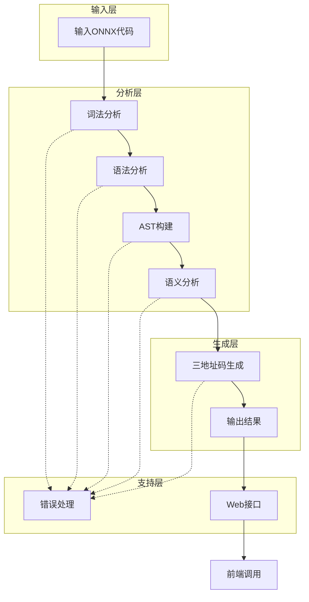
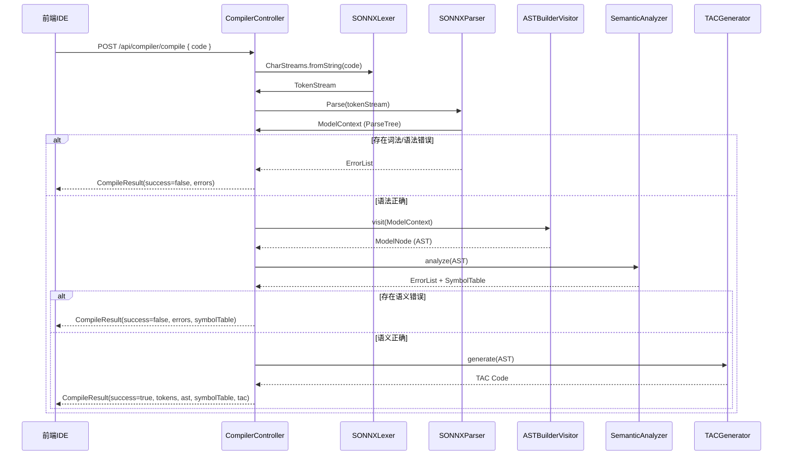
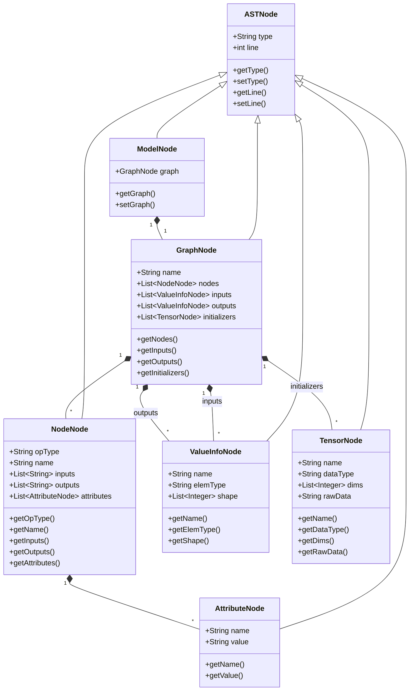
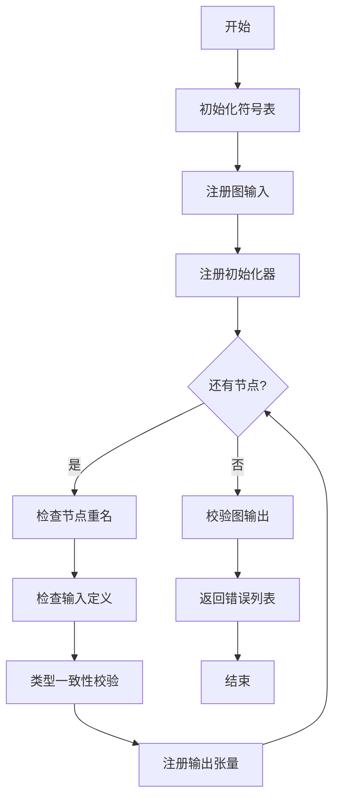
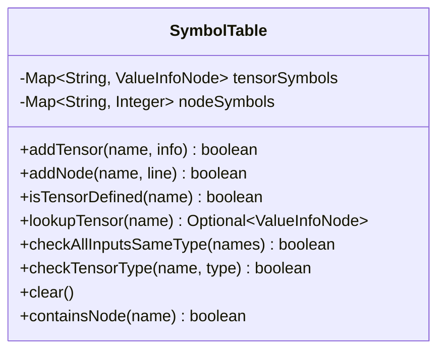
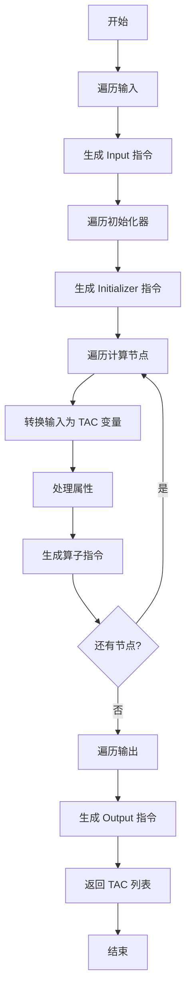
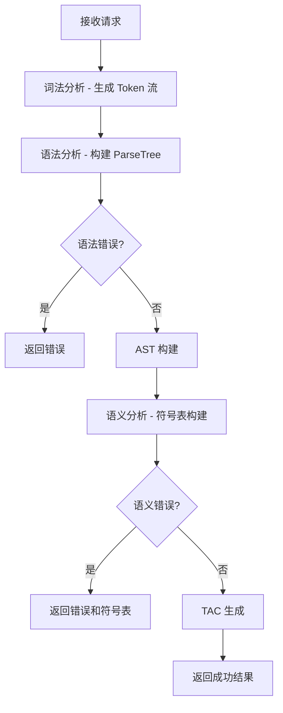
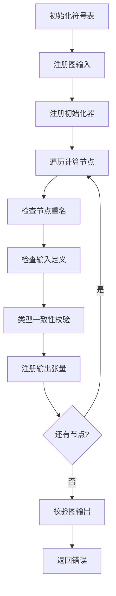
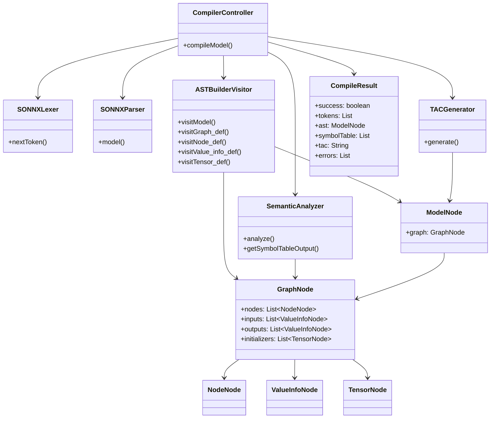
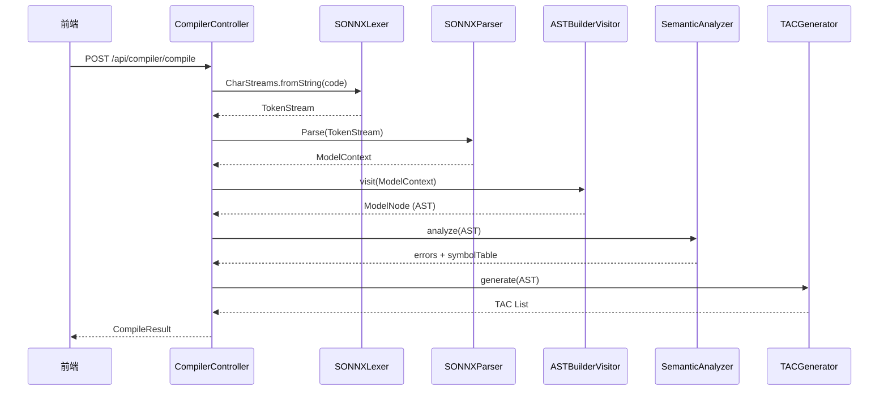

# S-ONNX Compiler 设计方案

## 1. 项目概述

S-ONNX Compiler 是一个基于 ANTLR4 的编译器项目，用于处理 ONNX（Open Neural Network Exchange）模型文件。该编译器实现了完整的编译流程，包括词法分析、语法分析、抽象语法树构建、语义分析和三地址码生成。

### 1.1 项目架构



### 1.2 技术栈

| 技术 | 版本 | 用途 |
|------|------|------|
| Java | 23 | 后端核心语言 |
| Spring Boot | 3.2.x | Web 框架 |
| ANTLR4 | 4.13.1 | 词法/语法分析 |
| Vue | 3.5.x | 前端框架 |
| Element Plus | 2.13.x | UI 组件库 |
| Monaco Editor | 0.55.x | 代码编辑器 |
| Maven | 3.6+ | 构建工具 |

---

## 2. 系统架构设计

### 2.1 模块划分

| 模块 | 职责 | 实现文件 |
|------|------|----------|
| **词法分析** | Token 识别和词法错误检测 | `SONNX.g4` (Lexer Rules) |
| **语法分析** | 语法规则解析和语法树构建 | `SONNX.g4` (Parser Rules) |
| **AST 构建** | 将 ParseTree 转换为自定义 AST | `ASTBuilderVisitor.java` |
| **语义分析** | 符号表管理和语义错误检测 | `SemanticAnalyzer.java`, `SymbolTable.java` |
| **代码生成** | 三地址码生成 | `TACGenerator.java` |
| **错误处理** | 统一错误收集和报告 | `CompileError.java`, `MyErrorListener.java` |
| **Web 接口** | REST API 服务 | `CompilerController.java` |

### 2.2 数据流



---

## 3. 词法分析模块

### 3.1 词法单元定义

| 类型 | 示例 | 描述 |
|------|------|------|
| **关键字** | `ModelProto`, `graph`, `node`, `input`, `output`, `initializer`, `name`, `type`, `shape`, `dims`, `data_type`, `elem_type`, `tensor_type`, `op_type`, `attribute`, `value`, `dim_value`, `dim_param`, `domain`, `version`, `raw_data`, `opset_import`, `ir_version`, `producer_name`, `producer_version`, `model_version`, `doc_string`, `int`, `float`, `string`, `bool` | 32 个关键字（不区分大小写） |
| **专用符号** | `{`, `}`, `[`, `]`, `=`, `,` | 6 个专用符号 |
| **整数** | `123`, `0`, `42L` | 整数字面量 |
| **字符串** | `"hello"`, `"test"` | 字符串字面量 |
| **字节数据** | `00ff00b`, `1234abcdb` | 字节数据字面量 |
| **注释** | `// comment`, `/* block */` | 单行和多行注释 |

### 3.2 词法规则

```antlr4
// 关键字（不区分大小写）
MODELPROTO     : 'ModelProto';
GRAPH          : 'graph';
NAME           : 'name';
NODE           : 'node';
INPUT          : 'input';
OUTPUT         : 'output';
OP_TYPE        : 'op_type';
ATTRIBUTE      : 'attribute';
INITIALIZER    : 'initializer';
DOC_STRING     : 'doc_string';
DOMAIN         : 'domain';
MODEL_VERSION  : 'model_version';
PRODUCER_NAME  : 'producer_name';
PRODUCER_VERSION: 'producer_version';
TYPE           : 'type';
TENSOR_TYPE    : 'tensor_type';
IR_VERSION     : 'ir_version';
ELEM_TYPE      : 'elem_type';
SHAPE          : 'shape';
DIM            : 'dim';
DIMS           : 'dims';
RAW_DATA       : 'raw_data';
OPSET_IMPORT   : 'opset_import';
DIM_VALUE      : 'dim_value';
DIM_PARAM      : 'dim_param';
DATA_TYPE      : 'data_type';
VERSION        : 'version';
VALUE          : 'value';
INT_T          : 'int';
FLOAT_T        : 'float';
STRING_T       : 'string';
BOOL_T         : 'bool';

// 数据类型
INTEGER : ('0' | [1-9][0-9]*) ('l' | 'L')?;
STRING : '"' ( '\\' ('b'|'t'|'n'|'f'|'r'|'"'|'\''|'\\') | ~('\\'|'"') )* '"';
BYTES : [0-9A-Fa-f]+ 'b';

// 忽略空白和注释
WS: [ \t\r\n]+ -> skip;
LINE_COMMENT: '//' ~[\r\n]* -> skip;
BLOCK_COMMENT: '/*' .*? '*/' -> skip;
```

---

## 4. 语法分析模块

### 4.1 语法规则结构

```antlr4
// 顶级模型结构
model: MODELPROTO '{' model_body_def '}';
model_body_def: ir_version_def producer_name_def producer_version_def domain_def 
               model_version_def doc_string_def graph_def opset_import_def;

// 图定义
graph_def: GRAPH '{' graph_body_def '}';
graph_body_def: name_def node_list input_list output_list initializer_list?;

// 计算节点
node_list: node_repeats+;
node_repeats: NODE '{' node_def '}';
node_def: op_type_def name_def (input_list | input_arr) (output_list | output_arr) attribute_list?;

// 输入/输出定义
input_arr: INPUT '=' '[' (STRING (',' STRING)*)? ']';
output_arr: OUTPUT '=' '[' (STRING (',' STRING)*)? ']';
input_list: input_repeats+;
input_repeats: INPUT '{' value_info_def '}';
output_list: output_repeats+;
output_repeats: OUTPUT '{' value_info_def '}';

// 类型定义
value_info_def: name_def type_def;
type_def: TYPE '{' tensor_type_def '}';
tensor_type_def: TENSOR_TYPE '{' elem_type_def shape_def '}';
elem_type_def: ELEM_TYPE '=' (INT_T | FLOAT_T | STRING_T | BOOL_T);

// 形状定义
shape_def: SHAPE '{' dim_list '}';
dim_list: dim_repeats+;
dim_repeats: DIM '{' dim_def '}';
dim_def: DIM_VALUE '=' INTEGER | DIM_PARAM '=' STRING;

// 张量定义
tensor_def: name_def data_type_def dims_def raw_data_def;
data_type_def: DATA_TYPE '=' (INT_T | FLOAT_T | STRING_T | BOOL_T);
dims_def: DIMS '=' INTEGER+;
raw_data_def: RAW_DATA '=' BYTES;

// 属性定义
attribute_list: attribute_repeats+;
attribute_repeats: ATTRIBUTE '{' attribute_def '}';
attribute_def: name_def value_def;
value_def: VALUE '=' STRING;

// 算子集导入
opset_import_def: OPSET_IMPORT '{' domain_def version_def '}';
version_def: VERSION '=' INTEGER;
```

### 4.2 语法规则优先级

| 优先级 | 规则 | 说明 |
|--------|------|------|
| 1 | `model` | 顶级规则 |
| 2 | `model_body_def` | 模型体定义 |
| 3 | `graph_def` | 计算图定义 |
| 4 | `graph_body_def` | 图体定义 |
| 5 | `node_def`, `value_info_def`, `tensor_def` | 节点和张量定义 |
| 6 | `type_def`, `shape_def`, `attribute_def` | 类型和属性定义 |

---

## 5. 抽象语法树设计

### 5.1 AST 节点层次结构



### 5.2 节点详细说明

| 节点类型 | 父类 | 核心属性 | 职责 |
|----------|------|----------|------|
| `ASTNode` | - | `type`, `line` | 所有 AST 节点的抽象基类 |
| `ModelNode` | `ASTNode` | `graph` | 表示整个 ONNX 模型 |
| `GraphNode` | `ASTNode` | `name`, `nodes`, `inputs`, `outputs`, `initializers` | 表示计算图 |
| `NodeNode` | `ASTNode` | `opType`, `name`, `inputs`, `outputs`, `attributes` | 表示计算节点（算子） |
| `ValueInfoNode` | `ASTNode` | `name`, `elemType`, `shape` | 表示张量元数据（输入/输出） |
| `TensorNode` | `ASTNode` | `name`, `dataType`, `dims`, `rawData` | 表示权重初始化数据 |
| `AttributeNode` | `ASTNode` | `name`, `value` | 表示节点属性 |

---

## 6. 语义分析模块

### 6.1 语义分析流程



### 6.2 语义规则

| 规则 | 描述 | 错误类型 |
|------|------|----------|
| **命名唯一性** | 计算节点名称在图内必须唯一 | Semantic |
| **定义先于使用** | 张量必须在使用前定义 | Semantic |
| **类型一致性** | 算子输入类型必须一致 | Semantic |
| **输出唯一性** | 同一张量不能被多个节点产出 | Semantic |
| **输出合法性** | 图输出必须由输入或节点产出 | Semantic |

### 6.3 符号表结构



---

## 7. 三地址码生成模块

### 7.1 TAC 格式规范

| 操作类型 | 格式 | 示例 |
|----------|------|------|
| **输入定义** | `T{num} = Input("{name}", {TYPE}, [{shape}])` | `T1 = Input("input1", FLOAT, [1, 3, 224, 224])` |
| **权重初始化** | `W{num} = Initializer("{name}", {TYPE}, [{shape}], raw_data={data})` | `W1 = Initializer("weight1", FLOAT, [64, 3, 3, 3], raw_data=00ff00b)` |
| **算子操作** | `T{num} = {OP_TYPE}({inputs}, {attributes})` | `T3 = Conv(T1, W1, kernel_shape=[3,3])` |
| **输出定义** | `Output("{name}", {var})` | `Output("output1", T2)` |

### 7.2 代码生成流程



---

## 8. 错误处理模块

### 8.1 错误分类

| 错误类型 | 触发条件 | 示例 |
|----------|----------|------|
| **Lexical** | 非法字符、未闭合字符串、无效字面量 | 未闭合的字符串 `"hello` |
| **Syntax** | 语法规则违反、缺少必要符号、结构不匹配 | 缺少右花括号 `}` |
| **Semantic** | 命名冲突、未定义使用、类型不匹配 | 使用未定义的张量 `undefined_var` |

### 8.2 错误数据结构

```java
public class CompileError {
    private String type;    // "Lexical", "Syntax", "Semantic"
    private int line;       // 错误行号
    private String message; // 错误描述
}
```

### 8.3 错误监听器

`MyErrorListener` 继承自 ANTLR 的 `BaseErrorListener`，自动捕获词法和语法错误：

| 方法 | 功能 |
|------|------|
| `syntaxError()` | ANTLR 回调方法，捕获错误并分类 |
| `getErrors()` | 获取所有收集的错误 |
| `hasErrors()` | 判断是否存在错误 |
| `clearErrors()` | 清空错误列表 |

---

## 9. Web API 接口

### 9.1 API 端点

| 端点 | 方法 | 描述 |
|------|------|------|
| `/api/compiler/compile` | POST | 编译 ONNX 代码 |

### 9.2 请求格式

```json
{
  "code": "ModelProto{...}"
}
```

### 9.3 响应格式

**成功响应** (`200 OK`):
```json
{
  "success": true,
  "tokens": [
    {"line": 1, "type": "MODELPROTO", "text": "ModelProto"},
    {"line": 1, "type": "LBRACE", "text": "{"}
  ],
  "ast": {
    "type": "ModelProto",
    "line": 1,
    "graph": {...}
  },
  "symbolTable": [
    "[input1] 类型: float, 维度: [1, 3, 224, 224]",
    "[weight1] 类型: float, 维度: [64, 3, 3, 3]"
  ],
  "tac": "T1 = Input(\"input1\", FLOAT, [1, 3, 224, 224])\nW1 = Initializer(\"weight1\", FLOAT, [64, 3, 3, 3])",
  "errors": []
}
```

**失败响应** (`200 OK`):
```json
{
  "success": false,
  "tokens": [...],
  "ast": null,
  "symbolTable": [],
  "tac": "",
  "errors": [
    {
      "type": "Semantic",
      "line": 10,
      "message": "算子 [Add] 引用了未定义的张量: undefined_input"
    }
  ]
}
```

---

## 10. 输入输出示例

### 10.1 输入（S-ONNX 模型）

```
ModelProto{
ir_version = 8
producer_name = "onnx-example"
producer_version = "1.0"
domain = "example_domain"
model_version = 1
doc_string = "Example model"
graph {
   name = "test-model"
   node {
      op_type = "Pad"
      name = "test-node"    
      input = ["X", "pads", "value"]
      output = ["Y"]
      attribute {
        name = "mode"
        value = "constant"
      }
   }
   input {
      name = "X"
      type {
        tensor_type {
          elem_type = int
          shape {
            dim { dim_value = 3 }
            dim { dim_value = 2 }
          }
        }
      }
   }
   input {
     name = "pads"
     type {
       tensor_type {
         elem_type = int
         shape {
            dim { dim_value = 1 }
            dim { dim_value = 4 }
         }
       }
      }
   }
   input {
     name = "value"
     type {
        tensor_type {
          elem_type = int
          shape { dim { dim_value = 1 } }
        }
     }
   }
   output {
     name = "Y"
     type {
        tensor_type {
          elem_type = int
          shape {
            dim { dim_value = 3 }
            dim { dim_value = 4 }
          }
        }
     }
    }
    initializer {
      name = "conv.bias" 
      data_type = int
      dims = 1 2 3 4
      raw_data = 000000000000b
   }
}
opset_import {
  domain = "ai.onnx"
  version = 15
}
}
```

### 10.2 输出（三地址码）

```
T1 = Input("X", INT, [3, 2])
T2 = Input("pads", INT, [1, 4])
T3 = Input("value", INT, [1])
W1 = Initializer("conv.bias", INT, [1, 2, 3, 4], raw_data=000000000000b)
T4 = Pad(T1, T2, T3, mode=constant)
Output("Y", T4)
```

---

## 11. 部署与运行

### 11.1 环境要求

- **Java**: JDK 23（推荐 Adoptium Temurin）
- **Maven**: 3.6+
- **Node.js**: 18+（前端构建）

### 11.2 构建命令

```bash
# 构建后端
mvn clean package

# 启动后端服务
java -jar target/bianyi-1.0-SNAPSHOT.jar
# 或使用批处理文件
bat/run.bat

# 构建前端
cd front/sonnx-web
npm install
npm run build
```

或者使用bat文件直接运行后端和前端（其中bat文件已经写好，包括jdk的下载配置，我的项目已经打包成jar包了，不需要IDE也可以哈）

### 11.3 服务访问

- **API 端点**: `http://localhost:8080/api/compiler/compile`
- **健康检查**: `http://localhost:8080/actuator/health`
- **前端**: 构建后通过 `dist` 目录部署，或运行 `npm run dev` 启动开发服务器

## 12. 代码说明

### 12.1 启动类

#### 12.1.1 CompilerApplication

**文件**: `src/main/java/cn/edu/nwpu/sonnx/CompilerApplication.java`

**功能**: Spring Boot 应用启动类，初始化 Spring 上下文并启动 Web 服务。

**方法**:

| 方法   | 签名                                     | 描述         |
| ------ | ---------------------------------------- | ------------ |
| `main` | `public static void main(String[] args)` | 启动应用入口 |

### 12.2 启动类

#### 12.2.1 CompilerController

**文件**: `src/main/java/cn/edu/nwpu/sonnx/controller/CompilerController.java`

**功能**: 提供 REST API 接口，处理编译请求。

**注解**:

- `@CrossOrigin(origins = "*")`: 允许跨域请求
- `@RestController`: REST 控制器
- `@RequestMapping("/api/compiler")`: 基础路径

**内部类**:

| 类名                | 字段           | 描述                   |
| ------------------- | -------------- | ---------------------- |
| `SourceCodeRequest` | `code: String` | 接收前端发送的源码请求 |

**方法**:

| 方法           | 签名                                                         | 描述                                                         |
| -------------- | ------------------------------------------------------------ | ------------------------------------------------------------ |
| `compileModel` | `@PostMapping("/compile") public CompileResult compileModel(@RequestBody SourceCodeRequest request)` | 编译 ONNX 代码，执行词法分析→语法分析→AST构建→语义分析→TAC生成 |

**编译流程**:



### 12.3 错误处理模块

#### 12.3.1 CompileError

**文件**: `src/main/java/cn/edu/nwpu/sonnx/core/error/CompileError.java`

**功能**: 统一错误实体类，表示编译过程中的错误。

**字段**:

| 字段      | 类型   | 描述                                      |
| --------- | ------ | ----------------------------------------- |
| `type`    | String | 错误类型：`Lexical`, `Syntax`, `Semantic` |
| `line`    | int    | 错误行号                                  |
| `message` | String | 错误详细描述                              |

**方法**:

| 方法       | 签名                       | 描述                                                         |
| ---------- | -------------------------- | ------------------------------------------------------------ |
| `toString` | `public String toString()` | 返回格式化的错误字符串，格式: `[type Error] Line line: message` |

#### 12.3.2 MyErrorListener

**文件**: `src/main/java/cn/edu/nwpu/sonnx/core/error/MyErrorListener.java`

**功能**: ANTLR 错误监听器，自动捕获词法和语法错误。

**继承**: `BaseErrorListener`

**字段**:

| 字段     | 类型                 | 描述               |
| -------- | -------------------- | ------------------ |
| `errors` | List\<CompileError\> | 存储所有捕获的错误 |

**方法**:

| 方法          | 签名                                                         | 描述                             |
| ------------- | ------------------------------------------------------------ | -------------------------------- |
| `syntaxError` | `public void syntaxError(Recognizer, Object, int, int, String, RecognitionException)` | ANTLR 回调方法，自动分类错误类型 |
| `getErrors`   | `public List<CompileError> getErrors()`                      | 获取所有错误                     |
| `hasErrors`   | `public boolean hasErrors()`                                 | 判断是否存在错误                 |
| `clearErrors` | `public void clearErrors()`                                  | 清空错误列表                     |

### 12.4 解析器模块

#### 12.4.1 ASTBuilderVisitor

**文件**: `src/main/java/cn/edu/nwpu/sonnx/core/parser/ASTBuilderVisitor.java`

**功能**: 采用 Visitor 模式遍历 ANTLR 生成的 ParseTree，转换为自定义 AST 节点。

**继承**: `SONNXBaseVisitor<ASTNode>`

**方法**:

| 方法                  | 签名                                                         | 描述                                 |
| --------------------- | ------------------------------------------------------------ | ------------------------------------ |
| `visitModel`          | `public ASTNode visitModel(SONNXParser.ModelContext ctx)`    | 访问模型根节点，构建 `ModelNode`     |
| `visitGraph_def`      | `public ASTNode visitGraph_def(SONNXParser.Graph_defContext ctx)` | 访问图定义，构建 `GraphNode`         |
| `visitNode_def`       | `public ASTNode visitNode_def(SONNXParser.Node_defContext ctx)` | 访问节点定义，构建 `NodeNode`        |
| `visitValue_info_def` | `public ASTNode visitValue_info_def(SONNXParser.Value_info_defContext ctx)` | 访问值信息定义，构建 `ValueInfoNode` |
| `visitTensor_def`     | `public ASTNode visitTensor_def(SONNXParser.Tensor_defContext ctx)` | 访问张量定义，构建 `TensorNode`      |
| `cleanQuotes`         | `private String cleanQuotes(String s)`                       | 清理字符串两端的引号                 |

### 12.5 语义分析模块

#### 12.5.1 SemanticAnalyzer

**文件**: `src/main/java/cn/edu/nwpu/sonnx/core/semantic/SemanticAnalyzer.java`

**功能**: 语义分析器，执行符号表管理和语义错误检测。

**字段**:

| 字段                  | 类型                         | 描述               |
| --------------------- | ---------------------------- | ------------------ |
| `errors`              | List\<CompileError\>         | 语义错误列表       |
| `tensorSymbolTable`   | Map\<String, ValueInfoNode\> | 张量符号表         |
| `nodeNameSet`         | Set\<String\>                | 节点名称集合       |
| `nodeProducedTensors` | Set\<String\>                | 节点产出的张量集合 |

**方法**:

| 方法                   | 签名                                                 | 描述                       |
| ---------------------- | ---------------------------------------------------- | -------------------------- |
| `analyze`              | `public List<CompileError> analyze(ModelNode model)` | 执行语义分析，返回错误列表 |
| `getSymbolTableOutput` | `public List<String> getSymbolTableOutput()`         | 获取符号表的字符串表示     |
| `cleanType`            | `private String cleanType(String type)`              | 清理类型字符串             |

**分析流程**:



#### 12.5.2 SymbolTable

**文件**: `src/main/java/cn/edu/nwpu/sonnx/core/semantic/SymbolTable.java`

**功能**: 通用符号表工具类，提供符号管理和类型校验方法。

**字段**:

| 字段            | 类型                         | 描述                      |
| --------------- | ---------------------------- | ------------------------- |
| `tensorSymbols` | Map\<String, ValueInfoNode\> | 张量符号映射              |
| `nodeSymbols`   | Map\<String, Integer\>       | 节点名称映射（名称→行号） |

**方法**:

| 方法                     | 签名                                                         | 返回值   | 描述                     |
| ------------------------ | ------------------------------------------------------------ | -------- | ------------------------ |
| `addTensor`              | `public boolean addTensor(String name, ValueInfoNode info)`  | boolean  | 添加张量，检查重名       |
| `addNode`                | `public boolean addNode(String name, int line)`              | boolean  | 添加节点，检查重名       |
| `isTensorDefined`        | `public boolean isTensorDefined(String name)`                | boolean  | 检查张量是否已定义       |
| `lookupTensor`           | `public Optional<ValueInfoNode> lookupTensor(String name)`   | Optional | 查找张量信息             |
| `checkAllInputsSameType` | `public boolean checkAllInputsSameType(String... tensorNames)` | boolean  | 检查输入张量类型是否一致 |
| `checkTensorType`        | `public boolean checkTensorType(String tensorName, String expectedType)` | boolean  | 检查张量类型             |
| `clear`                  | `public void clear()`                                        | void     | 清空符号表               |
| `containsNode`           | `public boolean containsNode(String name)`                   | boolean  | 判断节点是否存在         |

---

### 12.6 三地址码生成模块

#### 12.6.1 TACGenerator

**文件**: `src/main/java/cn/edu/nwpu/sonnx/core/tac/TACGenerator.java`

**功能**: 三地址码生成器，将 AST 转换为 TAC 中间代码。

**字段**:

| 字段           | 类型                  | 描述                      |
| -------------- | --------------------- | ------------------------- |
| `tacList`      | List\<String\>        | TAC 指令列表              |
| `tCount`       | int                   | 中间变量计数器            |
| `wCount`       | int                   | 权重变量计数器            |
| `nameToTacVar` | Map\<String, String\> | AST 名称到 TAC 变量的映射 |

**方法**:

| 方法       | 签名                                            | 返回值         | 描述         |
| ---------- | ----------------------------------------------- | -------------- | ------------ |
| `generate` | `public List<String> generate(ModelNode model)` | List\<String\> | 生成三地址码 |

**TAC 格式**:

| 操作     | 格式                                                         | 示例                                                      |
| -------- | ------------------------------------------------------------ | --------------------------------------------------------- |
| 输入     | `T{num} = Input("{name}", {TYPE}, [{shape}])`                | `T1 = Input("input1", FLOAT, [1, 3])`                     |
| 初始化器 | `W{num} = Initializer("{name}", {TYPE}, [{shape}], raw_data={data})` | `W1 = Initializer("weight", FLOAT, [3, 3], raw_data=00b)` |
| 算子     | `T{num} = {OP_TYPE}({inputs}, {attrs})`                      | `T3 = Add(T1, T2)`                                        |
| 输出     | `Output("{name}", {var})`                                    | `Output("output1", T3)`                                   |

---

### 12.7 数据传输对象

#### 12.7.1 CompileResult

**文件**: `src/main/java/cn/edu/nwpu/sonnx/dto/CompileResult.java`

**功能**: 统一编译结果 DTO，整合全流程编译产物。

**字段**:

| 字段          | 类型                 | 描述                    |
| ------------- | -------------------- | ----------------------- |
| `success`     | boolean              | 编译是否成功            |
| `ast`         | ModelNode            | 生成的 AST 根节点       |
| `tac`         | String               | 生成的三地址码          |
| `errors`      | List\<CompileError\> | 所有错误列表            |
| `tokens`      | List\<TokenInfo\>    | 词法分析生成的 Token 流 |
| `symbolTable` | List\<String\>       | 符号表内容              |

**内部类 TokenInfo**:

| 字段   | 类型   | 描述           |
| ------ | ------ | -------------- |
| `line` | int    | Token 所在行号 |
| `type` | String | Token 类型     |
| `text` | String | Token 文本内容 |

**方法**:

| 方法        | 签名                                                         | 描述         |
| ----------- | ------------------------------------------------------------ | ------------ |
| `addError`  | `public void addError(String type, int line, String message)` | 添加单个错误 |
| `addErrors` | `public void addErrors(List<CompileError> errorList)`        | 批量添加错误 |

---

### 12.8 AST 模型节点

#### 12.8.1 ASTNode (抽象基类)

**文件**: `src/main/java/cn/edu/nwpu/sonnx/model/ast/ASTNode.java`

**功能**: 所有 AST 节点的抽象基类。

**字段**:

| 字段   | 类型   | 描述               |
| ------ | ------ | ------------------ |
| `type` | String | 节点类型名         |
| `line` | int    | 行号，用于错误定位 |

**方法**:

| 方法      | 签名                               | 描述         |
| --------- | ---------------------------------- | ------------ |
| `getType` | `public String getType()`          | 获取节点类型 |
| `setType` | `public void setType(String type)` | 设置节点类型 |
| `getLine` | `public int getLine()`             | 获取行号     |
| `setLine` | `public void setLine(int line)`    | 设置行号     |

#### 12.8.2 ModelNode

**文件**: `src/main/java/cn/edu/nwpu/sonnx/model/ast/ModelNode.java`

**功能**: 模型根节点，代表整个 ONNX 模型。

**继承**: `ASTNode`

**字段**:

| 字段    | 类型      | 描述   |
| ------- | --------- | ------ |
| `graph` | GraphNode | 计算图 |

#### 12.8.3 GraphNode

**文件**: `src/main/java/cn/edu/nwpu/sonnx/model/ast/GraphNode.java`

**功能**: 计算图节点，包含节点、输入、输出和初始化器。

**继承**: `ASTNode`

**字段**:

| 字段           | 类型                  | 描述         |
| -------------- | --------------------- | ------------ |
| `name`         | String                | 图名称       |
| `nodes`        | List\<NodeNode\>      | 计算节点列表 |
| `inputs`       | List\<ValueInfoNode\> | 输入张量列表 |
| `outputs`      | List\<ValueInfoNode\> | 输出张量列表 |
| `initializers` | List\<TensorNode\>    | 初始化器列表 |

#### 12.8.4 NodeNode

**文件**: `src/main/java/cn/edu/nwpu/sonnx/model/ast/NodeNode.java`

**功能**: 计算节点，代表 ONNX 算子。

**继承**: `ASTNode`

**字段**:

| 字段         | 类型                  | 描述                     |
| ------------ | --------------------- | ------------------------ |
| `opType`     | String                | 算子类型（如 Add, Conv） |
| `name`       | String                | 节点名称                 |
| `inputs`     | List\<String\>        | 输入张量名称列表         |
| `outputs`    | List\<String\>        | 输出张量名称列表         |
| `attributes` | List\<AttributeNode\> | 属性列表                 |

#### 12.8.5 ValueInfoNode

**文件**: `src/main/java/cn/edu/nwpu/sonnx/model/ast/ValueInfoNode.java`

**功能**: 值信息节点，描述输入/输出张量的元数据。

**继承**: `ASTNode`

**字段**:

| 字段       | 类型            | 描述                                 |
| ---------- | --------------- | ------------------------------------ |
| `name`     | String          | 张量名称                             |
| `elemType` | String          | 元素类型（int, float, string, bool） |
| `shape`    | List\<Integer\> | 张量维度                             |

#### 12.8.6 TensorNode

**文件**: `src/main/java/cn/edu/nwpu/sonnx/model/ast/TensorNode.java`

**功能**: 张量节点，代表权重初始化数据。

**继承**: `ASTNode`

**字段**:

| 字段       | 类型            | 描述         |
| ---------- | --------------- | ------------ |
| `name`     | String          | 张量名称     |
| `dataType` | String          | 数据类型     |
| `dims`     | List\<Integer\> | 维度列表     |
| `rawData`  | String          | 原始字节数据 |

#### 12.8.7 AttributeNode

**文件**: `src/main/java/cn/edu/nwpu/sonnx/model/ast/AttributeNode.java`

**功能**: 属性节点，代表算子属性。

**继承**: `ASTNode`

**字段**:

| 字段    | 类型   | 描述     |
| ------- | ------ | -------- |
| `name`  | String | 属性名称 |
| `value` | String | 属性值   |

---

### 12.9 ANTLR 生成代码

#### 12.9.1 SONNXLexer

**生成位置**: `target/generated-sources/antlr4/cn/edu/nwpu/sonnx/generated/SONNXLexer.java`

**功能**: 词法分析器，将源代码转换为 Token 流。

**关键字**: 32 个关键字（不区分大小写）

- `ModelProto`, `graph`, `node`, `input`, `output`, `initializer`, `name`, `type`, `shape`, `dims`, `data_type`, `elem_type`, `tensor_type`, `op_type`, `attribute`, `value`, `dim_value`, `dim_param`, `domain`, `version`, `raw_data`, `opset_import`, `ir_version`, `producer_name`, `producer_version`, `model_version`, `doc_string`, `int`, `float`, `string`, `bool`

**数据类型**:

- `INTEGER`: 整数
- `STRING`: 字符串
- `BYTES`: 字节数据

#### 12.9.2 SONNXParser

**生成位置**: `target/generated-sources/antlr4/cn/edu/nwpu/sonnx/generated/SONNXParser.java`

**功能**: 语法分析器，构建 ParseTree。

**主要规则**:

- `model`: 顶级模型规则
- `model_body_def`: 模型体定义
- `graph_def`: 图定义
- `node_def`: 节点定义
- `value_info_def`: 值信息定义
- `tensor_def`: 张量定义

---

### 12.10 前端组件

#### 12.10.1 App.vue

**文件**: `front/sonnx-web/src/App.vue`

**功能**: 前端主组件，提供 IDE 风格的编译界面。

**技术栈**:

- Vue 3 + Composition API
- Element Plus 组件库
- Monaco Editor 代码编辑器

**功能模块**:

1. 代码编辑区 - Monaco Editor
2. 词法分析结果展示
3. AST 树展示（JSON 格式）
4. 符号表展示
5. TAC 中间代码展示
6. 编译日志展示

**核心方法**:

| 方法            | 描述                       |
| --------------- | -------------------------- |
| `handleCompile` | 发起编译请求，调用后端 API |
| `astDisplay`    | 计算属性，格式化 AST JSON  |

---

### 12.11 依赖关系图



---

### 12.12 编译流程时序图



---

### 12.13 类使用示例

#### 12.13.1 编译流程示例

```java
// 1. 创建词法分析器
SONNXLexer lexer = new SONNXLexer(CharStreams.fromString(code));
CommonTokenStream tokens = new CommonTokenStream(lexer);

// 2. 创建语法分析器
SONNXParser parser = new SONNXParser(tokens);
SONNXParser.ModelContext ctx = parser.model();

// 3. 构建 AST
ASTBuilderVisitor visitor = new ASTBuilderVisitor();
ModelNode ast = (ModelNode) visitor.visit(ctx);

// 4. 语义分析
SemanticAnalyzer analyzer = new SemanticAnalyzer();
List<CompileError> errors = analyzer.analyze(ast);

// 5. 生成 TAC
TACGenerator generator = new TACGenerator();
List<String> tac = generator.generate(ast);
```

#### 12.13.2 错误处理示例

```java
// 创建错误监听器
MyErrorListener errorListener = new MyErrorListener();

// 配置词法分析器
SONNXLexer lexer = new SONNXLexer(CharStreams.fromString(code));
lexer.removeErrorListeners();
lexer.addErrorListener(errorListener);

// 配置语法分析器
SONNXParser parser = new SONNXParser(new CommonTokenStream(lexer));
parser.removeErrorListeners();
parser.addErrorListener(errorListener);

// 解析
SONNXParser.ModelContext ctx = parser.model();

// 检查错误
if (!errorListener.getErrors().isEmpty()) {
    // 处理错误
}
```

